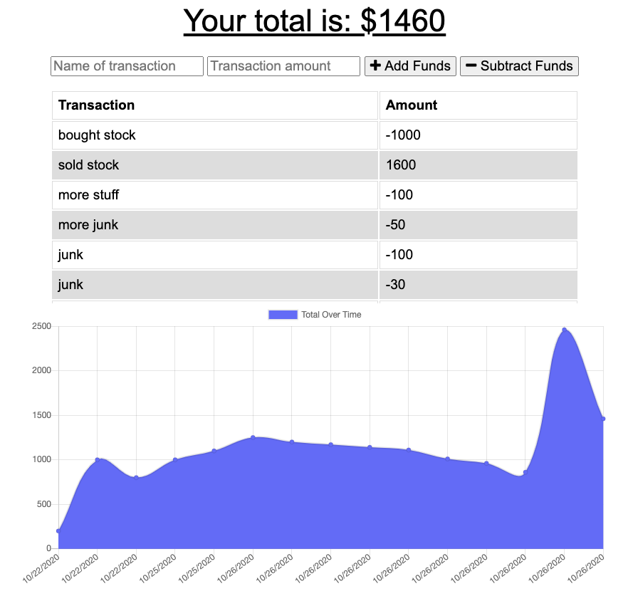

# ProgressiveBudget
## Description
This application allows a user to keep track of their budget by adding and subtracting funds. This enables the user to add expenses and deposits to their budget online or offline. When entering transactions offline, the user will be able to populate the total when brought back online. 

Please use the following link to view the deployed application: https://budget-tracker-byal.herokuapp.com/

## License

## Image
